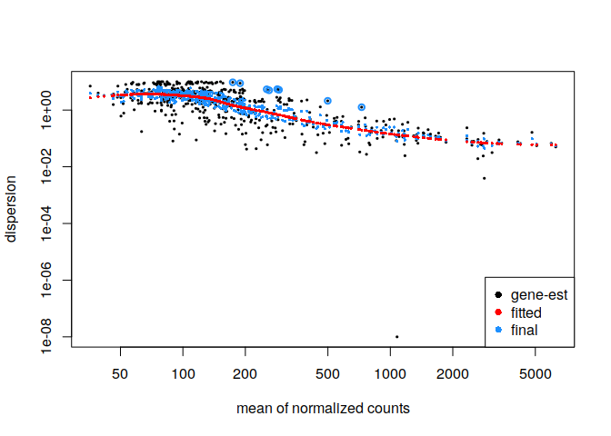
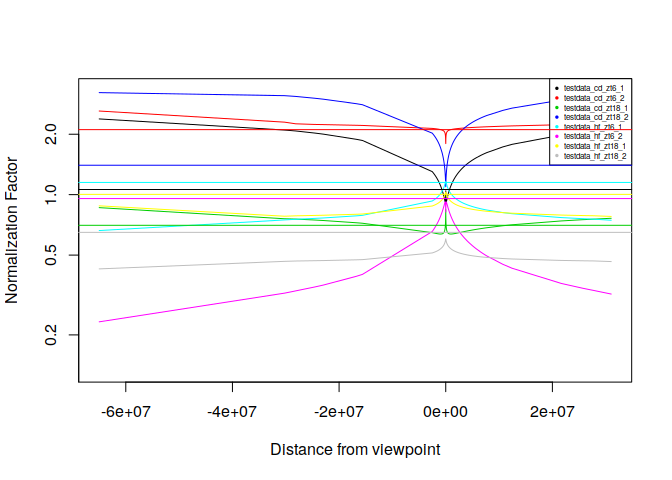
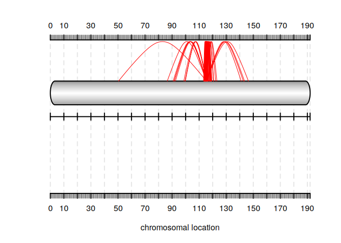

Difference Spider Plot
================
Guillermo de Anda-Jáuregui

En este documento continuamos el análisis para llegar a tener las regiones con diferencias en las frecuencias de interacciones

``` r
source("spider_plots.r")
library(FourCSeq)
```

    ## Loading required package: GenomicRanges

    ## Loading required package: stats4

    ## Loading required package: BiocGenerics

    ## Loading required package: parallel

    ## 
    ## Attaching package: 'BiocGenerics'

    ## The following objects are masked from 'package:parallel':
    ## 
    ##     clusterApply, clusterApplyLB, clusterCall, clusterEvalQ,
    ##     clusterExport, clusterMap, parApply, parCapply, parLapply,
    ##     parLapplyLB, parRapply, parSapply, parSapplyLB

    ## The following objects are masked from 'package:stats':
    ## 
    ##     IQR, mad, sd, var, xtabs

    ## The following objects are masked from 'package:base':
    ## 
    ##     anyDuplicated, append, as.data.frame, basename, cbind,
    ##     colMeans, colnames, colSums, dirname, do.call, duplicated,
    ##     eval, evalq, Filter, Find, get, grep, grepl, intersect,
    ##     is.unsorted, lapply, lengths, Map, mapply, match, mget, order,
    ##     paste, pmax, pmax.int, pmin, pmin.int, Position, rank, rbind,
    ##     Reduce, rowMeans, rownames, rowSums, sapply, setdiff, sort,
    ##     table, tapply, union, unique, unsplit, which, which.max,
    ##     which.min

    ## Loading required package: S4Vectors

    ## 
    ## Attaching package: 'S4Vectors'

    ## The following object is masked from 'package:base':
    ## 
    ##     expand.grid

    ## Loading required package: IRanges

    ## Loading required package: GenomeInfoDb

    ## Loading required package: ggplot2

    ## Loading required package: DESeq2

    ## Loading required package: SummarizedExperiment

    ## Loading required package: Biobase

    ## Welcome to Bioconductor
    ## 
    ##     Vignettes contain introductory material; view with
    ##     'browseVignettes()'. To cite Bioconductor, see
    ##     'citation("Biobase")', and for packages 'citation("pkgname")'.

    ## Loading required package: DelayedArray

    ## Loading required package: matrixStats

    ## 
    ## Attaching package: 'matrixStats'

    ## The following objects are masked from 'package:Biobase':
    ## 
    ##     anyMissing, rowMedians

    ## Loading required package: BiocParallel

    ## 
    ## Attaching package: 'DelayedArray'

    ## The following objects are masked from 'package:matrixStats':
    ## 
    ##     colMaxs, colMins, colRanges, rowMaxs, rowMins, rowRanges

    ## The following objects are masked from 'package:base':
    ## 
    ##     aperm, apply

    ## Loading required package: splines

    ## Loading required package: LSD

``` r
library(tidyverse)
```

    ## ── Attaching packages ───────────────────────────────────────────── tidyverse 1.2.1 ──

    ## ✔ tibble  2.0.1     ✔ purrr   0.3.0
    ## ✔ tidyr   0.8.2     ✔ dplyr   0.7.8
    ## ✔ readr   1.3.1     ✔ stringr 1.3.1
    ## ✔ tibble  2.0.1     ✔ forcats 0.3.0

    ## ── Conflicts ──────────────────────────────────────────────── tidyverse_conflicts() ──
    ## ✖ dplyr::collapse()   masks IRanges::collapse()
    ## ✖ dplyr::combine()    masks Biobase::combine(), BiocGenerics::combine()
    ## ✖ dplyr::count()      masks matrixStats::count()
    ## ✖ dplyr::desc()       masks IRanges::desc()
    ## ✖ tidyr::expand()     masks S4Vectors::expand()
    ## ✖ dplyr::filter()     masks stats::filter()
    ## ✖ dplyr::first()      masks S4Vectors::first()
    ## ✖ dplyr::lag()        masks stats::lag()
    ## ✖ ggplot2::Position() masks BiocGenerics::Position(), base::Position()
    ## ✖ purrr::reduce()     masks GenomicRanges::reduce(), IRanges::reduce()
    ## ✖ dplyr::rename()     masks S4Vectors::rename()
    ## ✖ purrr::simplify()   masks DelayedArray::simplify()
    ## ✖ dplyr::slice()      masks IRanges::slice()

Sacamos las diferencias considerando "cd\_zt6" como la condicion de referencia

``` r
#get differences 
fcf <- getDifferences(fcf,referenceCondition="cd_zt6")
```

Y hacemos los plots de analisis como marcan en la vignette

``` r
#analysis plots
plotDispEsts(fcf)
```



``` r
plotNormalizationFactors(fcf)
```



``` r
# plotMA(results(fcf, 
#                contrast=c("condition", "WE_68h", "MESO_68h")
#                ),
#        alpha=0.01,
#        xlab="Mean 4C signal",
#        ylab="log2 fold change",
#        ylim=c(-3.1,3.1)
#        )
```

Extracción de resultados
------------------------

Lo más importante será la extracción de los resultados, que se incorporaron al objeto fcf.

Extraigamos una comparación por pares

``` r
#here, the conditions should be modified for each experimental question
test_results <- as.data.frame(results(fcf, 
                            contrast =  c("condition", 
                                          "cd_zt6", 
                                          "hf_zt6"),
                            format = "GRanges")
                    )
```

Podemos filtrar estos resultados, por ejemplo, por logfold Change

``` r
#filter by log2FoldChange 

significant_results <- 
test_results %>% 
  filter(abs(log2FoldChange) >= 2 )
```

Spider plot
-----------

Usaremos la versión del spider plot del artículo enviado. Para esto, haremos unas pequeñas modificaciones a los datos que ya tenemos

``` r
#extract info of the viewpoint fragment 
my_viewpoint <- fcf@colData[1,c("start", "end")]
```

Este Spiderplot necesita un punto nada mas, así que tomemos el punto medio de nuestro viewpoint

``` r
#get midpoint of viewpoint
my_midpoint <- mean(my_viewpoint$start, my_viewpoint$end)
```

``` r
#make spider plot

#me quedo solo con las columnas start y end de mis resultados significativos
my_significant_spider <- significant_results[,c("start", "end")]
makeSpiderGramSingle(dom=my_significant_spider,, 
                     chrom.len=(max(my_significant_spider) - min(my_significant_spider))*2, #aqui le puse el doble de la region completa que                                 #contiene todos mis significativos, 
                     vp.loc=my_midpoint,
                     col="red"
                     ) 
```



Y con eso terminamos
